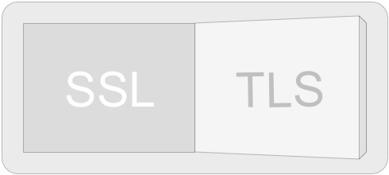

ssl-to-tls
=============

Chrome extension that replaces occurrences of ' SSL ' with ' TLS '

[Direct download of crx file](https://github.com/rimhoffd/ssl-to-tls/blob/master/SSLtoTLS.crx?raw=true)

Forks are free to do whatever they like.  But officially, _this_ extension replaces only the phrase described above. Thank you for your concern.

Screenshot Gallery
------------------

o_o soon...

Installation
------------

In Chrome, choose Window > Extensions.  Drag SSLtoTLS.crx into the page that appears.

Safari Version
--------------

Can be found here: https://github.com/logancollins/cloud-to-butt-safari

Firefox Version
---------------

Can be found here: https://github.com/DaveRandom/cloud-to-butt-mozilla

Opera Version
---------------

Can be found here: https://github.com/DaveRandom/cloud-to-butt-opera
